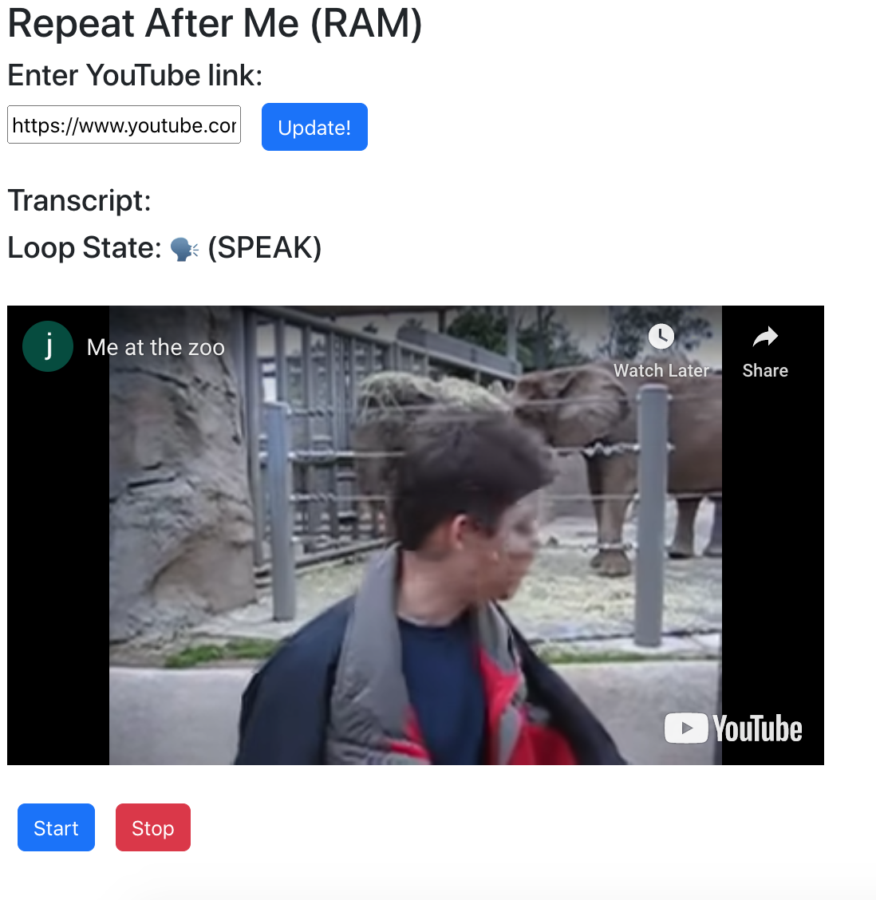

# Repeat After Me (RAM)

Repeat After Me (RAM) is a simple educational tool to automatically pause-and-play YouTube videos

This repository contains ReactJS code to 
play any YouTube video in intervals of 5s

## Why did you build this?

To learn speaking, a big part is to get 
used to the pronunciation. YouTube
has a huge repository of videos that can be
used for this purpose
## How to install and execute
You can run it as any React app using `npm start`

## Sample Screenshot

## Whom to contact?

Please direct your queries to [gpavanb1](http://github.com/gpavanb1)
for any questions.
